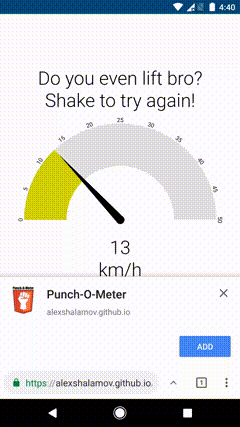
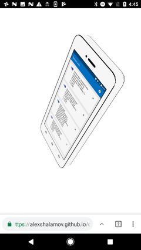

# Demos for Generic Sensor API

This repository contains applications that demonstrate how to use the
[Generic Sensor API](https://www.w3.org/TR/generic-sensor/).

The [Generic Sensor API](https://www.w3.org/TR/generic-sensor/) is a set of
interfaces which expose sensor devices to the web platform. The API consists
of the base [Sensor](https://w3c.github.io/sensors/#the-sensor-interface)
interface and a set of concrete sensor classes built on top, such as
[Accelerometer](https://w3c.github.io/accelerometer/#accelerometer-interface),
[LinearAccelerationSensor](https://w3c.github.io/accelerometer/#linearaccelerationsensor-interface),
[Gyroscope](https://w3c.github.io/gyroscope/#gyroscope-interface),
[AbsoluteOrientationSensor](https://w3c.github.io/orientation-sensor/#absoluteorientationsensor-interface)
and [RelativeOrientationSensor](https://w3c.github.io/orientation-sensor/#relativeorientationsensor-interface).

The Generic Sensor API is very simple and easy-to-use! The Sensor interface has
[`start()`](https://w3c.github.io/sensors/#sensor-start) and
[`stop()`](https://w3c.github.io/sensors/#sensor-stop) methods to control sensor state
and several event handlers for receiving notifications about sensor activation, errors and newly
available readings. The concrete sensor classes usually add their specific reading attributes to
the base class.

## Launch instructions

The demo apps work with Chrome 63 or later. If you have an older version of Chrome, please enable
the [chrome://flags/#enable-generic-sensor](chrome://flags/#enable-generic-sensor) flag, before
running the demos.

If the demo is using environmental sensors, such as,
[Magnetometer](https://w3c.github.io/magnetometer/#magnetometer-interface) or
[AmbientLightSensor](https://w3c.github.io/ambient-light/#ambient-light-sensor-interface),
please also enable
[chrome://flags/#enable-generic-sensor-extra-classes](chrome://flags/#enable-generic-sensor-extra-classes)
flag.

You could run demos from [GitHub Pages for this repository.](https://intel.github.io/generic-sensor-demos/)

## Demos description

### [Punchmeter](https://intel.github.io/generic-sensor-demos/punchmeter/) ([code](https://github.com/intel/generic-sensor-demos/tree/master/punchmeter))

Punchmeter is a simple application that calculates user's punch speed using
LinearAcceleration sensor. To try it the user should make a punch holding
mobile device in his/her hand.

---

### [Orientation phone](https://intel.github.io/generic-sensor-demos/orientation-phone/) ([code](https://github.com/intel/generic-sensor-demos/tree/master/orientation-phone))

This simple demo illustrates how an absolute orientation sensor can be used to
modify rotation quaternion of a 3D model. The <code>model</code> is a three.js
[`Object3D`](https://threejs.org/docs/index.html#api/core/Object3D) class instance
that has [`quaternion`](https://threejs.org/docs/index.html#api/core/Object3D.quaternion)
property.

---

### [360 degree beach panorama demo](https://intel.github.io/generic-sensor-demos/websensor-panorama/) ([code](https://github.com/intel/generic-sensor-demos/tree/master/websensor-panorama))

The demo presents a 360 degree panorama view of a beach with an added sound effect.
The user can look around the scene by moving their device.
The demo uses the orientation sensor to enable the user to look around.

---

### [360 degree video demo](https://intel.github.io/generic-sensor-demos/websensor-video/) ([code](https://github.com/intel/generic-sensor-demos/tree/master/websensor-video))

This demo presents a 360 degree video that the user can look around by moving their device.
The user can also play the video in both forward and reverse by holding the device and walking
forward and backward, respectively.
The demo uses the orientation sensor to enable the user to look around and the accelerometer for
walking detection to enable the user to control video playback by walking.

---

### [Ambient Map demo](https://intel.github.io/generic-sensor-demos/ambient-map/build/bundled/) ([code](https://github.com/intel/generic-sensor-demos/tree/master/ambient-map/build/bundled))

This web application demonstrates how Ambient light sensor can be used to control style of a map widget.
When ambient illuminance level is less than 10 lumen, night mode style will be used.

**Note:** this demo requires
[chrome://flags/#enable-generic-sensor-extra-classes](chrome://flags/#enable-generic-sensor-extra-classes)
flag set.

---

### [Sensor Info demo](https://intel.github.io/generic-sensor-demos/sensor-info/build/bundled/) ([code](https://github.com/intel/generic-sensor-demos/tree/master/sensor-info/build/bundled))

This web application presents information about device sensors and their reading values.

**Note:** this demo requires
[chrome://flags/#enable-generic-sensor-extra-classes](chrome://flags/#enable-generic-sensor-extra-classes)
flag set.

---

### [VR Button demo](https://intel.github.io/generic-sensor-demos/vr-button/build/bundled/) ([code](https://github.com/intel/generic-sensor-demos/tree/master/vr-button/build/bundled))

This web application demonstrates how Magnetometer sensor can be used to provide user input for WebVR
content. If you have VR enclosure with magnet button, you can interact with objects in the scene by
sliding button down.

**Note:** this demo requires
[chrome://flags/#enable-generic-sensor-extra-classes](chrome://flags/#enable-generic-sensor-extra-classes)
flag set.

---

### [Sensor tester](https://intel.github.io/generic-sensor-demos/sensor-tester/build/bundled/) ([code](https://github.com/intel/generic-sensor-demos/tree/master/sensor-tester))

This web application allows to test functionality of the sensors, correctness of their models in correspondence with respective specification.

**Note:** this demo requires
[chrome://flags/#enable-generic-sensor-extra-classes](chrome://flags/#enable-generic-sensor-extra-classes)
flag set.

## Development environment

If you would like to modify the existing code and experiment with the sensors API
your code must be hosted on a web server that supports HTTPS.
The simplest way is to fork this repository and enable
[GitHub Pages](https://help.github.com/articles/configuring-a-publishing-source-for-github-pages/)
for your fork. Alternatevely, you can serve your web application locally, for this, we recommend to use
[Web Server for Chrome](https://chrome.google.com/webstore/detail/web-server-for-chrome/ofhbbkphhbklhfoeikjpcbhemlocgigb).
If you are developing for mobile devices,set up
[port forwarding](https://developers.google.com/web/tools/chrome-devtools/remote-debugging/local-server)
for your local server, and you are good to go!

## Reporting a security issue
If you have information about a security issue or vulnerability with an Intel-maintained open source project on https://github.com/intel, please send an e-mail to secure-opensource@intel.com. Encrypt sensitive information using our PGP public key. For issues related to Intel products, please visit https://security-center.intel.com.